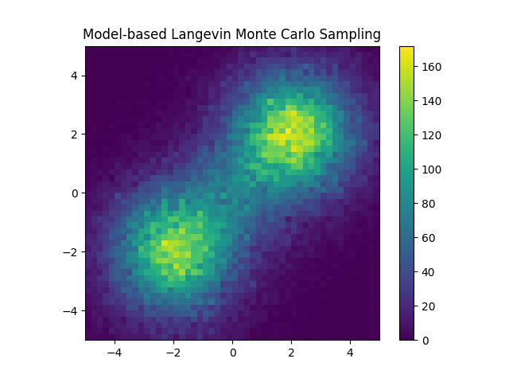
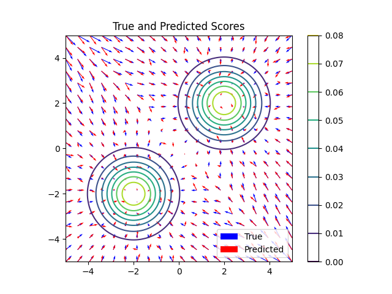

## Denoising Score Matching
[拡散モデル データ生成技術の数理](https://www.amazon.co.jp/%E6%8B%A1%E6%95%A3%E3%83%A2%E3%83%87%E3%83%AB-%E3%83%87%E3%83%BC%E3%82%BF%E7%94%9F%E6%88%90%E6%8A%80%E8%A1%93%E3%81%AE%E6%95%B0%E7%90%86-%E5%B2%A1%E9%87%8E%E5%8E%9F-%E5%A4%A7%E8%BC%94/dp/400006343X) でも取り扱われている Denoising Score Matching のコードです。

Denoising Score Matching (DSM) は、データの確率密度の勾配（スコア関数）を学習する手法です。ノイズの加わったデータを元に戻す過程で、スコア関数を推定します。この手法は、生成モデルや異常検知に利用され、ノイズを除去しつつデータの本質的な構造を学習します。DSMは、ノイズのあるデータから直接スコア関数を学習するため、通常のスコアマッチング手法よりもロバストです。





## 使用方法
以下のコマンドを実行することで `2次元混合正規分布 (mixture_distribution.png)`, `混合分布の等高線図 (score_plot.png)`, `モデルベースのランジュバン・モンテカルロ法によるサンプリング結果 (langevin_sampling.png)`, `Loss の推移 (loss_plot.png)` を plot します

```bash
make up
```

以下のコマンドで作成した image の削除します

```bash
make clean
```

## 参考
[【拡散モデル初心者向け】実装例から学ぶデノイジングスコアマッチング: Pytorch使用](https://qiita.com/Keisuke_Hori/items/764b2c75a85a91f14a51)